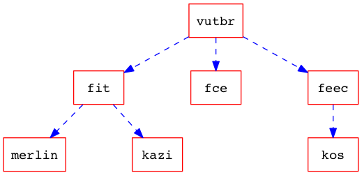

# MemGraph #
MemGraph je knihovna pro tvorbu grafické reprezentace stavů paměti programu. Je určena především pro verifikační nástroj [Predator](http://www.fit.vutbr.cz/research/groups/verifit/tools/predator/), případně [Forester](http://www.fit.vutbr.cz/research/groups/verifit/tools/forester/). Tyto dva nástroje jsou vyvíjeny výzkumnou skupinou [veriFIT](http://www.fit.vutbr.cz/research/groups/verifit/.cs) na fakultě informačních technologií VUT v Brně.

Knihovna implementuje tvorbu grafových struktur a jejich následnou vizualizaci objektově orientovaným přístupem v jazyce C++(11) a je k dispozici k dalším úpravám a libovolnému použití pod licencí GNU GPLv3.

## Vlastnosti knihovny ##
Knihovna je rozdělena na dvě části - datový model a funkční část.

Datový model poskytuje sadu metod pro tvorbu grafových struktur. Je inspirovaný prvky grafu, které popisuje teorie grafu - hrany, vrcholy a podgrafy. 

Funkční část zpracovává datový model a transformuje jej do požadované podoby. V případě knohovny je možné provést transormace do struktury jazyka DOT, případně vytvořit vizuální reprezentaci struktury. Pro tvorbu vizuální reprezentace je použita knihovna [Graphviz](http://www.graphviz.org). V datovém modelu je možné jednotlivým prvkům grafu přidávat atributy, které představují vizuální informaci pro vykreslení nástrojem Graphviz.

### Dostupné funkce knihovny
* Výpis datového modelu ve struktuře DOT
* Grafický výstup datového modelu
* Načtení struktury DOT a převod do datového modelu knihovny
* Transformace datového modelu do jiné podoby (level-of-details některých prvků nástroje Predator - pouze na ukázku)

### V plánu
* Napojení na verifikační nástroj Forester
* Porovnání dvou grafových struktur (izomorfismus)
* Vizuální styly verifikačního nástroje Predator

## Příklad použití ##
Příklad tvorby datového modelu

	// vytvori novy graf
	Graph *graph = new Graph();
	
	// nastavi grafu atribut
	graph->setAttr("nodesep",1);

	Attributes node_attrs;
	Attributes edge_attrs;

	// nastaveni defaultni atributu vrcholu grafu
	node_attrs.setAttr("color","red");
	node_attrs.setAttr("fontname","Courier");
	node_attrs.setAttr("shape","box");

	// nastaveni defaultni atributu hran grafu
	edge_attrs.setAttr("color","blue");
	edge_attrs.setAttr("style","dashed");

	// predani atributu instanci grafu
	graph->setNodeAttrs(&node_attrs);
	graph->setEdgeAttrs(&edge_attrs);

	// pridani hran
	graph->addEdge("vutbr", "fit");
	graph->addEdge("vutbr", "fce");
	graph->addEdge("vutbr", "feec");
	graph->addEdge("fit", "merlin");
	graph->addEdge("fit", "kazi");
	graph->addEdge("feec", "kos");
	
Generování struktury DOT z definovaného datového modelu
	
	// DOT generujeme volanim metody getDot() na instanci tridy GraphvizPlotter

	// vytvoreni instance tridy GraphvizPlotter, kteremu predame definovany datovy model	
	GraphvizPlotter *plotter = new GraphvizPlotter(graph);
	
	// volani metody getDot()
	plotter->getDot();
	
Dostaneme následující DOT strukturu
	
	digraph G {
		nodesep=1;

		node [color=red,fontname=Courier,shape=box];

		edge [color=blue,style=dashed];

		vutbr -> fit;
		vutbr -> fce;
		vutbr -> feec;
		fit -> merlin;
		fit -> kazi;
		feec -> kos;
	}
	
Pro generování vizuální reprezentace nastavíme pomocí metody setOutputPath(std::string path) cestu uložení souboru, metodou setOutputName(std::string name) jméno souboru a setOutputFormat(GraphvizPlotter::output format) výsledný formát souborů, ve kterém bude graf uložen. K dispozici jsou standardní formáty jako png, pdf, svg apod. Graf vykreslíme voláním metody plot(). Všechny tyto metody jsou veřejnými metodamy třídy GraphvizPlotter

	// ./example.png
	plotter->setOutputPath("./");
	plotter->setOutputFormat(GraphvizPlotter::PNG);
	plotter->setOutputName("example");
	plotter->plot();
	
Výsledek grafického výstupu reprezentuje níže uvedený obrázek

Je vhodné dodat, že tuto knihovnu není nutné použít pouze v návaznosti na verifikační nástroje Predator a Forester. Díky univerzálnosti datového modelu je možné definovat jakékoli grafové struktury.

## Závislosti knihovny
Knihovna je určena především pro distribuce systému Linux, respektive Ubuntu. Nicméně je otestována a plně funkční také pod OSX El Capitan. Pod os Windows 7 byla knihovna pro účely testování pouze přeložena a sestavena. Pro správnou funkčnost knihovny je nutné mít v systému Linux dostupné tyto nástroje a knihovny (v této konfiguraci otestováno):

* GCC 4.9.3
* CMake 2.8
* libgraphviz-dev

## Nasazení na verifikační nástroj Predator
Vnořte se do složky, do které chcete stáhnout verifikační nástroj Predator a knihovnu MemGraph. Následně stáhněte nástroj Predator

	git clone https://github.com/kdudka/predator.git
	
a knihovnu MemGraph 

	git clone https://github.com/Moouseer/MemGraph.git
	
Nástroj Predator pro svoji korektní funkci potřebuje závisloti překladače GCC. Níže jsou uvedeny příkazy pro doinstalování závislostí pro GCC 4.9 systému Ubuntu.

	sudo apt-get install g++-4.9-multilib
	sudo apt-get install gcc-4.9-plugin-dev
	sudo apt-get install libboost-all-dev
	sudo apt-get install cmake

Nyní nainstalujeme závistlosti knihovny MemGraph

	sudo apt-get install libgraphviz-dev
	
	
Nahradíme některé nezbytné soubory z repozitáře nástroje Predator soubory knihovny MemGraph (CMakeFiles, symplot.cc, ...). 

	cd MemGraph/
	
	find . -name "*.cpp" -type f -not -path "./predator/sl/Memgraph/*" -exec cp {} predator/sl/Memgraph/ \;
	
	find . -name "*.h" -type f -not -path "./predator/sl/Memgraph/*" -exec cp {} predator/sl/Memgraph/ \;
	
	cp -R ./predator/sl ../predator/

Nástroj Predator přeložíme a sestavíme společně s knihovnou MemGraph

	cd ../predator/
	./switch-host-gcc.sh /usr/bin/gcc-4.9
	
Po překladu a sestavení frameworku Code Listener je spuštěn překlad a sestavení knihovny MemGraph a následně překlad a sestavení verifikačního nástroje Predator. Po překladu a sestavení nástroje Predator je spuštěna sada 849 testů. Je nutné říci, že při sestavení s knihovnou MemGraph neprojdou celkem tři testy. Tyto testy nejsou dokončeny a tak se testovací skript zasekne u 846 testu a čeká na výsledky. Toto čekání je nutné přerušit pomocí zkratky ctrl + c. 

Testy ve složce sl_build tvoří textové a grafické výstupy verifikace. Výstupy jsou tvořeny následnovně:

Predator

* Generuje soubory s příponou dot, které v názvu souboru neobsahují řetězec bcPlot

MemGraph

* Generuje soubory s příponou dot, které v názvu souboru obsahují řetězec bcPlot (výsledek metody getDot())
* Generuje soubory s příponout png, které v názvu souboru obsahují řetězec bcPlot (výsledek metody plot())
* Generuje soubory s příponout png, které v názvu souboru obsahují řetězec parsed_bcPlot (načtení původního dot souboru z nástroje Predator, vložení obsahu do metody parseDot() a následné vytvoření grafu pomoci metody plot())
* Generuje soubory s příponout png, které v názvu souboru obsahují řetězec zabstract_bcPlot (provedení vzorových transformací nad objekty SLS a DLS a vrcholu Value SMG grafu)

	
	
	